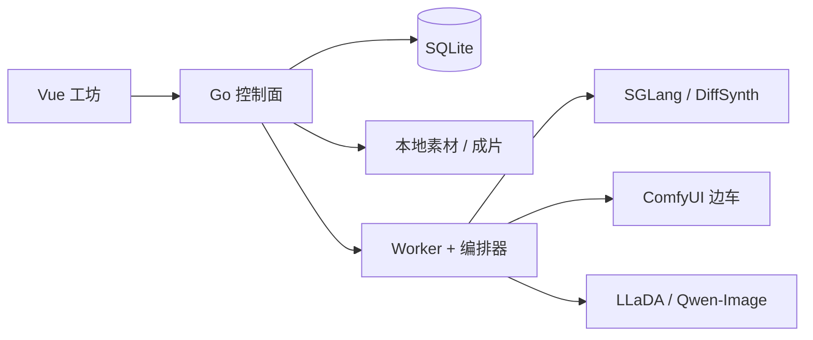

# Aishow

本机 [MiniMax-H3](https://github.com/MiniMax-AI/MiniMax-H3) 影像工坊。在浏览器里投递文生视频、首尾帧、参考生成和文生图；Go 控制面管队列、账号与素材，推理由本机边车完成。

没有 GPU 也能先用 `mock` 模式把界面和队列跑通。

<p align="center">
  
</p>

## 界面

| 指挥台 | 生成工坊 |
| :---: | :---: |
|  |  |
| 机器占用、边车是否在线、产线快照 | 选引擎与模式，写提示词，投入队列 |

| 作品库 | 推理节点 |
| :---: | :---: |
|  |  |
| 回看成片，下载，把参数填回工坊 | 切换 mock / auto，填写边车地址 |

队列、登录、用户管理的截图和逐步说明见 [使用说明](docs/usage.md)。

## 功能

- **视频**：文生 `t2va`，首帧 / 尾帧 / 首尾帧 `fl2va`，参考生成 `ref2va`；Timeline Director 用 SelfLift 二采试加速
- **图片**：LLaDA-Image / Qwen-Image-2.1 文生图 `t2i`、指令编辑 `i2i`
- **队列**：SQLite 持久化；离线引擎也能先投，轮到再启动边车
- **24GB 单卡**：默认同时只加载 1 个模型，队列跨引擎时自动切换
- **多用户**：第一个账号是管理员；任务和成片按账号隔离
- **可选**：官方 H3-Context-IR 提示增强
- **演示**：`mock` 走完整队列，不加载权重

本地 H3 输出短边 768、24fps、32kHz 立体声。2K 再生仍走官方 H3-Regenerate-2K，未进默认队列。

## 架构



| 层 | 技术 | 职责 |
| --- | --- | --- |
| 界面 | Vue 3 + Vite | 指挥台、工坊、队列、作品库、推理节点、用户管理 |
| 控制面 | Go + Gin + SQLite | API、账号、队列、编排边车启停 |
| 推理 | 本机 Python 边车 | 加载权重并出片，不进控制面进程 |

控制面默认 http://127.0.0.1:9808 ，开发界面默认 http://127.0.0.1:5173 。

## 环境

| 用途 | 需要 |
| --- | --- |
| 只跑界面和队列 | Windows，[Go](https://go.dev/dl/) 1.21+，[Node.js](https://nodejs.org/) 20+ |
| 本机出片 | 再加 NVIDIA GPU。24GB 可跑量化档；官方全量 SGLang 要多卡 |
| 权重 | Hugging Face 账号按需；下载脚本可走代理 / aria2 |

## 安装与启动

```bat
git clone https://github.com/showx/aishow.git
cd aishow
scripts\dev.bat
```

脚本会补齐缺失的 `.env`，并分别打开后端和前端窗口。浏览器访问 http://127.0.0.1:5173 。

手动启动：

```bash
# 后端
cd backend
cp .env.example .env    # Windows: copy .env.example .env
go mod tidy
go run ./cmd/server

# 前端（另开终端）
cd frontend
cp .env.example .env
npm install
npm run dev
```

首次打开页面会创建管理员。默认推理模式是 `mock`：提交任务会走完整队列，但不加载模型。

已经构建过 `frontend/dist` 时，也可以只开后端，用 http://127.0.0.1:9808 访问。

## 第一次使用

1. 创建账号并登录
2. 打开 **生成工坊**，选一个引擎（`mock` 下都会显示可排队）
3. 写一句镜头提示，点 **投入队列**
4. 到 **任务队列** 看进度，完成后去 **作品库** 回看

`mock` 成功后没有真实 MP4，卡片上会标「模拟成品」。要出真片，按下一节接边车。

逐步说明（含每页截图）：[docs/usage.md](docs/usage.md)

## 接上本机推理

1. 复制路径文件并按本机修改（**不要提交**）：

   ```bat
   copy scripts\paths.example.bat scripts\paths.bat
   ```

   只填写 `MODELS_ROOT`。H3、ComfyUI、DiffSynth、LLaDA、缓存和边车成品都放在这个目录里。

2. 按显存下载权重、启动对应 `scripts\start_*.bat`。24GB 常见起点：

   | 你想做 | 引擎 | 下载 | 启动 |
   | --- | --- | --- | --- |
   | 先出一条文生视频 | FastH3 GGUF Q4 | `download_fasth3_gguf.ps1` | `start_fasth3_gguf.bat` |
   | 文生 / 首尾帧 | H3-Base NF4 或 Turbo LoRA | 见引擎文档 | `start_h3_nf4.bat` / `start_h3_turbo_lora.bat` |
   | 参考图生成 | H3 Ref2VA INT8 | `download_h3_ref2va.ps1` | `start_h3_ref2va_int8.bat` |
   | 二采加速文生 / 参考 | H3 Timeline Director | `download_h3_latent_upscaler.ps1` | `start_h3_director.bat` |
   | 文生图 | LLaDA-Image | clone 官方仓库 | `start_llada_image.bat` |
   | 文生 / 首帧 | HunyuanVideo-1.5 | `download_hunyuan_video.ps1` | `start_hunyuan_video.bat` |
   | 文生 / 首帧，带声音 | LTX-2.3 | `download_ltx23.ps1` | `start_ltx23.bat` |
   | 文生图 | Qwen-Image-2.1 | `download_qwen_image.ps1` | `start_qwen_image.bat` |

3. 打开 **推理节点**，把模式改成 `auto`，保存。
4. 回到工坊选刚启动的引擎，先用 **480p / 5 秒** 试一条。

完整端口、显存、PinkCherry 与 FastH3 不要混用 8188/8189、官方多卡 SGLang：[docs/engines.md](docs/engines.md)

## 文档

| 文档 | 内容 |
| --- | --- |
| [使用说明](docs/usage.md) | 登录、指挥台、工坊、短剧、队列、作品库、节点、用户 |
| [引擎与权重](docs/engines.md) | `paths.bat`、下载、启动、LLaDA、Qwen-Image、SGLang |
| [配置与局域网](docs/config.md) | `.env`、账号、CORS、备份、常见问题 |

## 目录

```
backend/     Go API、队列、Worker、Python 边车
frontend/    Vue 3 工坊
scripts/     启动 / 下载脚本（本机路径见 paths.bat）
docs/        使用说明与界面截图
```

## 问题与贡献

遇到启动失败、边车连不上或某页看不懂，先看 [常见问题](docs/config.md#常见问题)，再开 Issue。欢迎 PR：修文档、补引擎、改界面都可以。

刷新 README 截图（需要本机已登录得了的管理员账号）：

```bat
cd docs
npm install
node capture-screenshots.mjs
```

## 致谢

推理能力来自这些上游项目，Aishow 只做本机工坊与调度：

- [MiniMax-H3](https://github.com/MiniMax-AI/MiniMax-H3) / [SGLang](https://github.com/sgl-project/sglang)
- [DiffSynth-Studio](https://github.com/modelscope/DiffSynth-Studio)
- [ComfyUI](https://github.com/comfyanonymous/ComfyUI) · [FastH3 GGUF](https://huggingface.co/realrebelai/FastH3_GGUFs) · [Timeline Director](https://github.com/Songssx/ComfyUI-MiniMaxH3-TimelineDirector)
- [LLaDA-Image](https://github.com/inclusionAI/LLaDA-Image)
- [Qwen-Image-2.1](https://huggingface.co/Qwen/Qwen-Image-2.1)
- [HunyuanVideo-1.5](https://github.com/Tencent-Hunyuan/HunyuanVideo-1.5)
- [LTX-2.3](https://huggingface.co/Lightricks/LTX-2.3)
