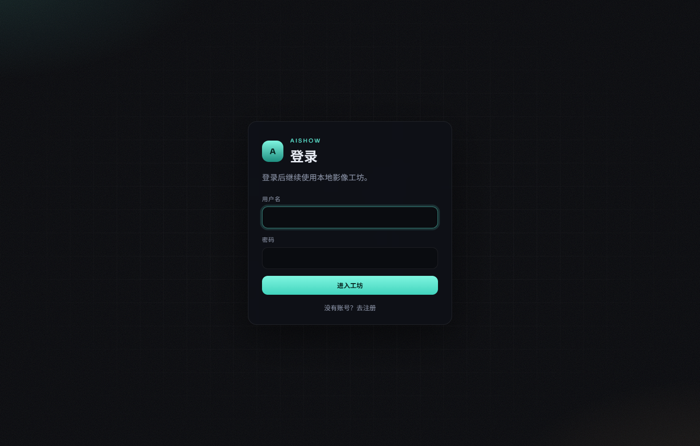
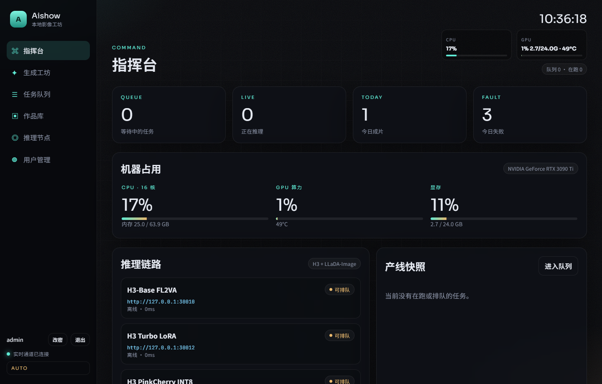
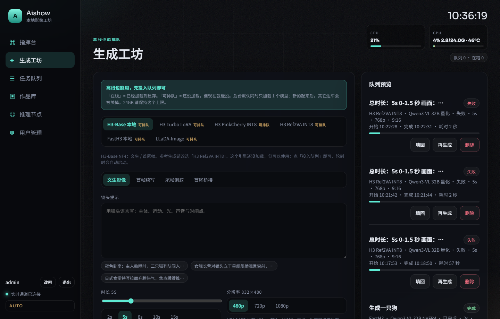
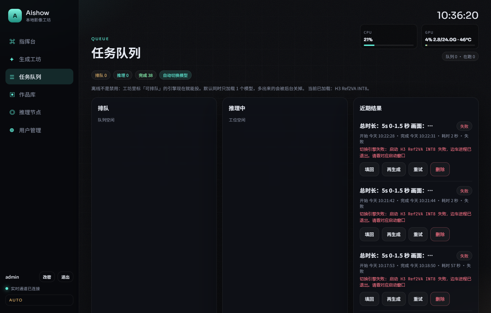
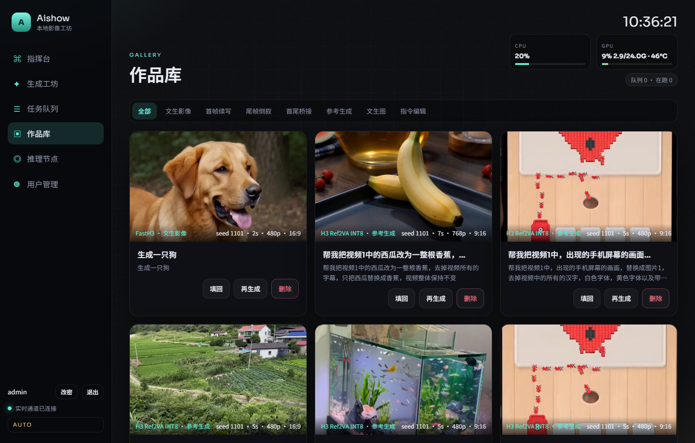
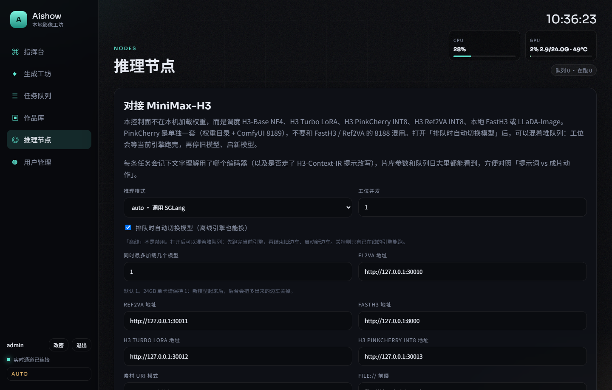
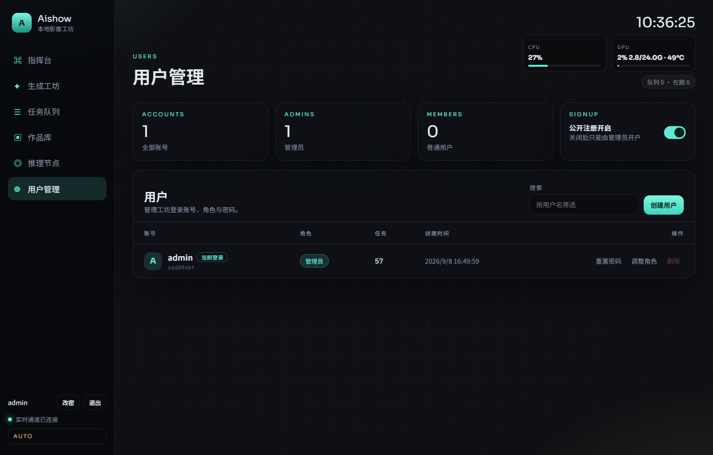

# 使用说明

这页按真实界面走一遍：从第一次打开，到投递任务、看队列、下载成片。不需要 GPU 也能先用 `mock` 把流程跑通。

## 第一次打开

1. 按 [README](../README.md#安装与启动) 启动后，浏览器打开 http://127.0.0.1:5173
2. 仓库里还没有任何账号时，登录页会变成「创建账号」。填用户名和至少 6 位密码
3. 第一个账号自动成为**管理员**
4. 之后可在「用户管理」里给别人开账号，或打开公开注册

任务、上传的素材、成片都按账号隔离。普通用户只能看见自己的内容。

## 指挥台

登录后默认进指挥台，用来看整台机器和产线状态，而不是写提示词。

- **今日成片 / 队列深度 / 失败数**：当天产线是否在转
- **机器占用**：CPU、内存、GPU 算力与显存。没有 GPU 时会显示「未检测到 GPU」
- **推理链路**：每条边车是「在线」（权重已在显存）还是「可排队」（还没加载，但工坊仍可投）
- **产线快照 / 最近成片**：正在跑的任务，以及刚完成的结果；「填回工坊」会把参数带回生成页

「可排队」不是禁用。后台默认同时只加载 1 个模型；打开自动切换后，轮到这条任务时再启对应边车。

## 生成工坊

日常投递都在这里。左侧填任务，右侧是最近队列预览。

### 投一条视频

1. 选引擎。标签「在线」= 已经占着显存；「可排队」= 现在就能投，轮到再启动
2. 选模式：
   - **文生** `t2va`：只写镜头提示
   - **首帧 / 尾帧 / 首尾帧** `fl2va`：上传对应图片
   - **参考生成** `ref2va`：参考图（最多 9 张），可选参考视频 / 音频。请用 H3 Ref2VA INT8 或 H3 Timeline Director
3. 写提示词。视频用镜头语言（主体、运动、光、声音、时间点）；点下方示例可先填一句再改
4. 调时长、分辨率、画幅。24GB 单卡建议先从 **480p / 5 秒** 试一条
5. 需要时展开「高级采样」改 Seed、步数、Flow Shift。勾选「H3-Context-IR」要先在推理节点填 MiniMax Token
6. 点 **投入队列**。引擎离线时按钮会写成「投入队列（离线可用）」

FastH3 只做文生。H3-Base / Turbo / PinkCherry 做文生和首尾帧。参考生成请换 Ref2VA 或 Timeline Director。Director 有 Latent Upscaler 时走 SelfLift 二采，可用来对照能不能更快出片；超过 15 秒会自动分段，最长 30 秒。

### 投一张图（LLaDA-Image）

1. 引擎选 **LLaDA-Image**
2. **文生图** `t2i` 只写画面；**指令编辑** `i2i` 再拖一张参考图
3. Turbo 是 4 步蒸馏；Base 是约 50 步高品质。边车加载的 checkpoint 要和档位一致
4. 默认边长 1024。文生需能被 16 整除，指令编辑需能被 32 整除

第一次加载 LLaDA Turbo 大约 46GB 权重要读盘上 GPU，等几分钟是正常的。

### 填回与再生成

工坊右侧、队列、作品库都有：

- **填回**：把提示词、素材角色、采样参数载入工坊。原来的任务不会被覆盖，改完再投一条
- **再生成**：按相同参数新建任务，并换一个 Seed

## 任务队列

三列：排队、推理中、近期结果。

| 操作 | 作用 |
| --- | --- |
| 插队 | 把排队中的任务提到更前面 |
| 取消 / 中止 | 排队中取消；推理中中止 |
| 重试 | 失败任务按原参数再进队列 |
| 再生成 | 成功任务换 Seed 再跑一条 |
| 删除 | 连记录一起去掉；已成功的还会删成片 |

打开「排队时自动切换模型」后，可以混着堆不同引擎。当前引擎跑完，编排器再停旧边车、启新边车。关掉之后，只有已经在线的引擎会真正跑，离线任务会失败。

## 作品库

完成的视频和图片在这里。点卡片打开大图 / 播放器，右侧是当时的提示词、增强提示和全部生成参数。

- 顶部可按模式筛选
- **下载成片 / 下载图片** 从详情里取
- **填回 / 再生成 / 删除** 与队列相同
- `mock` 模式下完成的任务没有真实文件，卡片上会标「模拟成品」

## 短剧

- 侧栏「短剧」是漫剧制作台：剧本 → 分镜 → 出图 → 成片 → 合成。角色本全程可见，顶部分镜条随时跳镜。出图和成片可以穿插，不必等全部出完图才去成片。左右方向键切镜。

- **生成本地剧本 / 本地拆分镜 / 重写出图·成片·衔接**：走本机 Ollama 小模型，默认 `qwen3.5:4b`（`scripts\start_drama_chat.bat`）。不要选 `qwen3-vl`。不是 H3 / LLaDA。
- **角色 / 场景参考**：剧本、出图、成片步都可以上传人物或场景图。出图时第一张进 LLaDA 指令编辑，其余名字写进提示。成片选 Director / Ref2VA 时，这些图会和本镜出图一起送进模型（最多 9 张）。每一镜还可以再加本镜额外参考。
- 续写引擎选 H3 / Turbo / PinkCherry 时，会抽上一镜**尾帧**当本镜首帧；Ref2VA / Director 仍用上一镜成片续写，并继续带上角色 / 场景参考图。
- 合成可勾选**烧录字幕**（对白）和**叠本地语音**（可选 OpenAI 兼容 TTS）。没配 TTS 就只用 H3 音轨。
- `mock` 且 Chat 连不上时，会用模板文本把流程跑通。
- 第 2 镜起续写成片用「将@视频1从最后一帧向后延长」，不要写成「参考视频1」。
- 仍可全程手写剧本和分镜，不强制开 Chat。

## 推理节点

管理员在这里切 `mock` / `auto`，填边车地址、本地 Chat，以及是否自动切换模型。

常见项：

- **推理模式**：没有 GPU 用 `mock`；本机边车起来后改 `auto` 并保存
- **同时最多加载几个模型**：24GB 保持 `1`
- **素材 URI 模式**：本地边车用 `http` 回源控制面；官方 SGLang 容器常用 `file://`
- **Public Base URL**：给边车回源用，本机请保持 `http://127.0.0.1:9808`，不要改成局域网 IP
- **工位并发**：改完需要重启后端

各引擎的下载、启动和端口见 [引擎与权重](engines.md)。

## 用户管理

仅管理员可见。

- 创建用户、改角色、重置密码、删除账号
- **公开注册**：关上之后，登录页不再出现「去注册」，只能由管理员开户
- 重置密码会踢掉对方已有会话
- 删除账号会一并删除该用户的任务、素材和成片，不可恢复

也可以在 `backend/.env` 里用 `AISHOW_ADMIN_USER` / `AISHOW_ADMIN_PASSWORD` 预置管理员，详见 [配置](config.md)。
